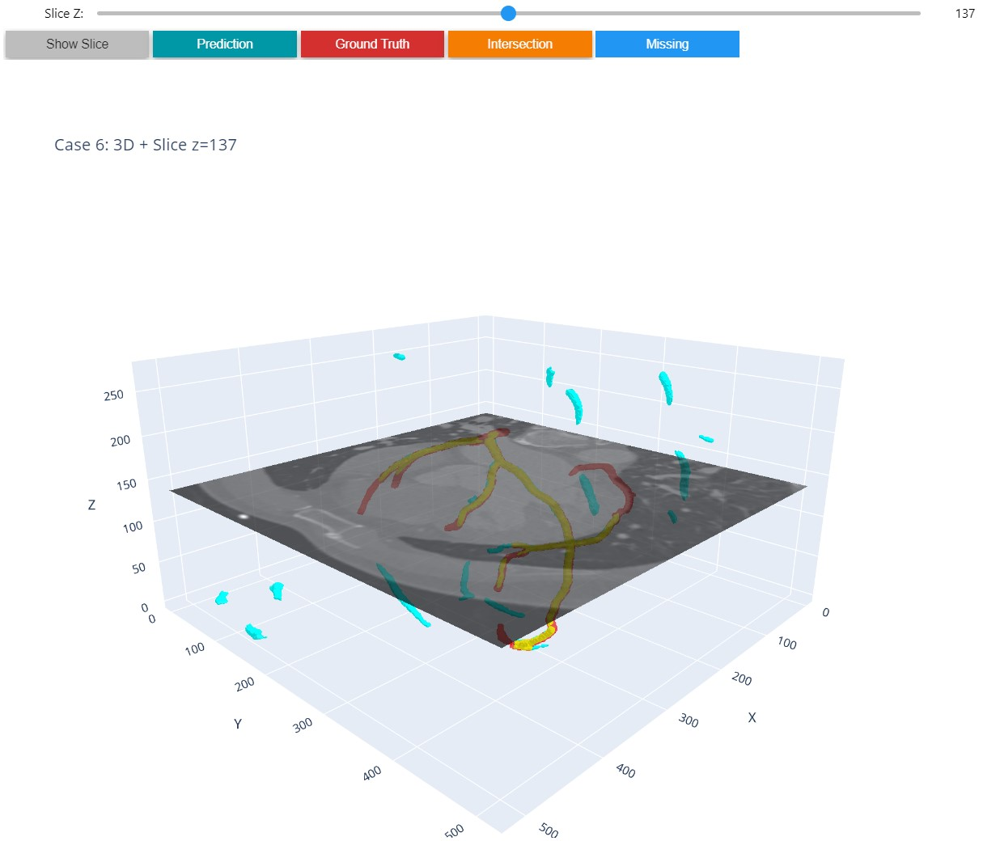
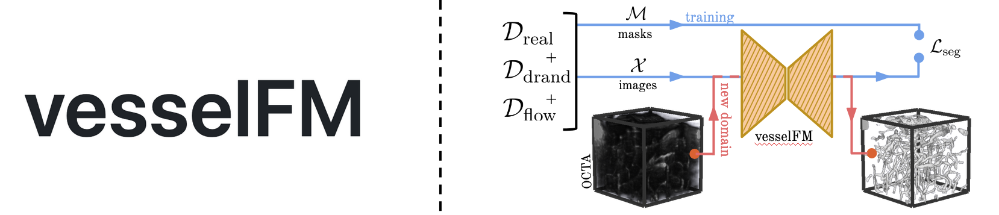
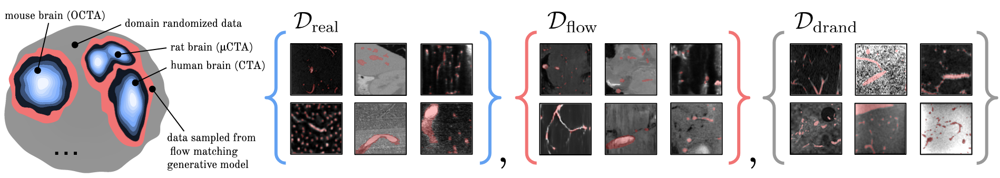

# Task 1
## Summary
This repository contains the code and data for vesselFM, a foundation model for universal 3D blood vessel segmentation. The model is designed to perform *zero* to few-shot segmentation on unseen domains, leveraging a combination of real, synthetic, and domain-randomized data.

- This foundation model was picked for its ability to generalize across diverse datasets and adapt to perform well in low data scenarios, achieving state-of-the-art results on several benchmarks.
- This code was used as it provided a comprehensive framework for training, evaluating, and doing inference with the vesselFM model on external datasets.
- The dataset picked was [ImageCAS](https://www.kaggle.com/datasets/xiaoweixumedicalai/imagecas/data?select=Coronary_Segmentation_deep_learning), a large and diverse dataset bentchmark for coronary artery segmentation, based on CTA scans.
- The main libraries used include PyTorch & PyTorch Lightning for model training and evaluation and Plotly & Matplotlib for visualization. Additional libraries have been added to the requirements file to support data processing and visualization.

- The specific enhancements applied to the pretrained model include:
  - Modifications to the image augmentation pipeline (quite good out of the box) to better suit the characteristics of the ImageCAS dataset.
  - Fine-tuning on the ImageCAS dataset to adapt the model to the specific characteristics of coronary artery segmentation.
  - Adjustments to hyperparameters such as learning rate (including schedule), batch size, and number of epochs to optimize performance on the ImageCAS dataset.

### Performance metrics
Baseline foundation model (zero-shot) and best (highest dice score on the validation set) fine-tuned model performance on the ImageCAS test dataset:

| Checkpoint                       | accuracy | betti_0 | betti_0_error | betti_1 | betti_1_error | betti_2 | cldice | dice  | fpr   | jaccard_iou | loss  | pr_auc_ap | precision | recall_tpr_sensitivity | roc_auc | specificity |
|----------------------------------|----------|---------|---------------|---------|---------------|---------|--------|-------|-------|-------------|-------|-----------|-----------|------------------------|---------|-------------|
| baseline                         | 0.950    | 656.850 | 654.750       | 147.930 | 144.810       | 41.000  | 0.049  | 0.027 | 0.049 | 0.014       | 0.891 | 0.037     | 0.014     | 0.412                  | 0.887   | 0.951       |
| finetuned Cos LR decay 1e-3 RandCrop | 0.999    | 19.750  | 17.650        | 1.680   | 2.480         | 0.080   | 0.841  | 0.769 | 0.000 | 0.627       | 0.176 | 0.851     | 0.800     | 0.747                  | 0.997   | 1.000       |


- Runtime performance:
  - The model was trained on a single NVIDIA RTX 3090ti GPU (24gb), batch size 6.
  - Training time for the fine-tuning process was approximately 8.9 mins per epoch, with a total of 10 epochs.
  - Single scan inference time was approximately 14 seconds for the whole (512 x 512 x slices) volume using shifted window inference.

### To reproduce the results
- Follow the instructions in the [main README](README.md) to set up the environment and install dependencies.
- Download the foundation model weights.
- Follow the instructions in the [ImageCAS dataset preparation](ImageCASDataSetPrep.md) to prepare the ImageCAS dataset.
- Run the training script with the provided configuration file/s (changing the paths as necessary) for fine-tuning on the ImageCAS dataset:
  - [train yaml](./vesselfm/seg/configs/train.yaml)
  - [finetune yaml](./vesselfm/seg/configs/finetune.yaml)
  - [inference yaml](./vesselfm/seg/configs/inference.yaml)

  - Follow the instructions in the [vesselfm/seg](vesselfm/seg) directory for more details on training and inference.
  - The checkpoint of the best model weigths are included in the repository in the releases to the right (due to large file size ~300mb) `finetune_800shot_SMILE_vesselfm_step-1340_val_DiceMetric-0.77.ckpt`.
- Use the provided [visualisation script](visualise_ImageCAS.ipynb) to visualize the results on the ImageCAS dataset (test subset) with an interactive 3D plot of the segmentation.
  - The script also includes code to save STL files for the segmented volumes, which can be used for further analysis or visualization in other software.
  - Additional code to load said STL files and visualize them in 3D. STL files from one case (6) are provided in `./meshes_stl/`.

<!-- Visualisation script example plot image -->


### Limitations
- Due to the size of the ImageCAS dataset, the preparation scripts reduce the resolution of the images to 256x256xN slices, which may lead to loss of detail in the segmentation.
  - The slices were kept the same to aid in preserving more contextual information for the segmentation task, however this was not compared to other resolutions (time constraints).
- visualisation script uses marching cubes to generate a mesh from the voxel segmentation as plotting the voxels directly is extremely slow for large volumes, which may lead to artifacts in the mesh.
- The hyperparameters used for fine-tuning were not extensively optimized, and further tuning may yield better results.
  - Tested orders of magnitude (1e-5 - 1e-3) for learning rate, as well as the use of cosine annealing for each.
- The each component of the data augmentation pipeline was not individually evaluated on the ImageCAS dataset, and further augmentation strategies may improve performance.
  - Changes were made to how the initial crop was applied as by default it was only cropping to the center of the image, which was not suitable for the ImageCAS dataset.

# Main README



**TL;DR**: VesselFM is a foundation model for universal 3D blood vessel segmentation. It is trained on three heterogeneous data sources: a large, curated annotated dataset, synthetic data generated through domain randomization, and data sampled from a flow matching-based deep generative model. These data sources provide enough diversity to enable vesselFM to achieve exceptional *zero*-shot blood vessel segmentation, even in completely unseen domains. For details, please refer to our preprint (https://arxiv.org/pdf/2411.17386).

---


## 🟢 Installation
First, set up a conda environment and install dependencies:

    conda create -n vesselfm python=3.9

    conda activate vesselfm

    pip install -e .


## 🟢 *Zero*-Shot Segmentation
If you are solely interested in running vesselFM's inference script for *zero*-shot segmentation of data at hand, adjust the respecitve [config file](vesselfm/seg/configs/inference.yaml) (see `#TODO`) and run:

    python vesselfm/seg/inference.py

Additional information on inference, pre-training, and fine-tuning are available [here](./vesselfm/seg). Checkpoints will be downloaded automatically and are also available on [Hugging Face 🤗](https://huggingface.co/bwittmann/vesselFM).


## 🟢 Data Sources


We also provide individual instructions for generating our three proposed data sources.

$\mathcal{D}_\text{drand}$: Domain randomized synthetic data ([here](./vesselfm/d_drand)).

$\mathcal{D}_\text{flow}$: Synthetic data sampled from our flow matching-based deep generative model ([here](./vesselfm/d_flow)).

$\mathcal{D}_\text{real}$: Real data curated from 17 annotated blood vessel segmentation datasets ([here](./vesselfm/d_real)).


## 🟢 Citing vesselFM
If you find our work useful for your research, please cite:

```bibtex
@article{wittmann2024vesselfm,
  title={vesselFM: A Foundation Model for Universal 3D Blood Vessel Segmentation},
  author={Wittmann, Bastian and Wattenberg, Yannick and Amiranashvili, Tamaz and Shit, Suprosanna and Menze, Bjoern},
  journal={arXiv preprint arXiv:2411.17386},
  year={2024}
}
```

## 🟢 License
Code in this repository is licensed under [GNU General Public License v3.0](LICENSE). Model weights are released under [Open RAIL++-M License](https://huggingface.co/bwittmann/vesselFM/blob/main/LICENSE) and are restricted to research and non-commercial use only.